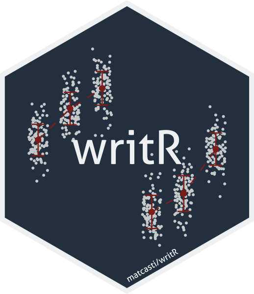

```{r logo, message=FALSE, warning=FALSE, include=FALSE}
library(hexSticker); library(ggplot2)
within <- 3
between <- 2
n <- 80

set.seed(123)
Stroop <- data.frame(
  Subject = rep(1:n, within),
  Gender = gl(between, n/between, length = n*within, labels = c('Male','Female')),
  Time = gl(within, n, length = n*within),
  Score = rnorm(n*within, mean = 150, sd = 50))

# Manipulate data to generate interaction between Gender and Time
Stroop <- within(Stroop, {
  Score[Gender == 'Male' & Time == 1] <- Score[Gender == 'Male' & Time == 1]
  Score[Gender == 'Male' & Time == 2] <- Score[Gender == 'Male' & Time == 2]+90
  Score[Gender == 'Male' & Time == 3] <- Score[Gender == 'Male' & Time == 3]+150
  Score[Gender == 'Female' & Time == 1] <- Score[Gender == 'Female' & Time == 1]-200
  Score[Gender == 'Female' & Time == 2] <- Score[Gender == 'Female' & Time == 2]-150
  Score[Gender == 'Female' & Time == 3] <- Score[Gender == 'Female' & Time == 3]-80
})

p <- 
  ggplot(aes(x = Time, y = Score, group = Gender), data = Stroop) + 
  facet_wrap(~ Gender, ) +
  geom_jitter(cex = 0.01, alpha = 1, col = '#D0D3D4', width = 0.3) +
  stat_summary(geom = 'point', fun = mean, col = '#922B21', cex = 0.8) +
  stat_summary(geom = 'errorbar', fun.data = ggpubr::mean_sd, width = 0.4, col = '#922B21', size = 0.3) +
  stat_summary(geom = 'line', fun = mean, lty = 2, col = '#922B21', lwd = 0.3) +
  theme_void() + theme(text = element_blank())

outfile <- "README_files/logo.png"
sticker(p, package="writR", 
        filename=outfile, 
        s_y = 1,
        s_x = 1,
        p_y = 1,
        p_color = "#F2F3F4",
        h_fill = '#2C3E50', 
        h_color = '#F2F3F4', 
        s_width = 1.5, 
        s_height = 1.5,
        url = 'matcasti/writR',
        u_color = 'white',
        dpi = 600)
```
 
<span style="display:block;text-align:center"></span>
 
<table style="margin-left: auto; margin-right: auto;">
  <tr>
    <th> <h1 style="text-align:left;">Inferential statistics and reporting in APA style</h1> </br>
         <p style="text-align:center;">For automated and basic inferential testing.</p> </th>
  </tr>
</table>
</br>

[](https://doi.org/10.5281/zenodo.4603838)

**writR** is an R package for automated inferential testing (for group differences) and reporting based on parametric assumptions, which are tested automatically for test selection.

### Installation

For installation of developmental version run in your R console:

``` r
install.packages("remotes")
remotes::install_github("matcasti/writR")
```

### Citation

To cite package 'writR' in publications run the following code in your `R` console:

```{r}
citation('writR')
```

## Summary of available tests using `autest()` function

#### For paired samples designs

| Nº of groups | Type                           | Test                                        | Function in `R`        |
|:------------:|--------------------------------|---------------------------------------------|------------------------|
|      2       | `type = 'p'`: parametric.      | Student's t-test.                           | `stats::t.test`        |
|      2       | `type = 'r'`: robust.          | Yuen's test for trimmed means.              | `WRS2::yuend`          |
|      2       | `type = 'np'`: non-parametric. | Wilcoxon signed-rank test.                  | `stats::wilcox.test`   |
|     \> 2     | `type = 'p'`: parametric.      | One-way repeated measures ANOVA (rmANOVA).  | `afex::aov_ez`         |
|     \> 2     | `type = 'p'`: parametric.      | rmANOVA with Greenhouse-Geisser correction. | `afex::aov_ez`         |
|     \> 2     | `type = 'p'`: parametric.      | rmANOVA with Huynh-Feldt correction.        | `afex::aov_ez`         |
|     \> 2     | `type = 'r'`: robust.          | Heteroscedastic rmANOVA for trimmed means.  | `WRS2::rmanova`        |
|     \> 2     | `type = 'np'`: non-parametric. | Friedman rank sum test.                     | `stats::friedman.test` |

#### For independent samples design

| Nº of groups | Type                           | Test                                             | Function in `R`       |
|:------------:|--------------------------------|--------------------------------------------------|-----------------------|
|      2       | `type = 'p'`: parametric.      | Student's t-test.                                | `stats::t.test`       |
|      2       | `type = 'p'`: parametric.      | Welch's t-test.                                  | `stats::t.test`       |
|      2       | `type = 'r'`: robust.          | Yuen's test for trimmed means.                   | `WRS2::yuen`          |
|      2       | `type = 'np'`: non-parametric. | Mann-Whitney *U* test.                           | `stats::wilcox.test`  |
|     \> 2     | `type = 'p'`: parametric.      | Fisher's One-way ANOVA.                          | `stats::oneway.test`  |
|     \> 2     | `type = 'p'`: parametric.      | Welch's One-way ANOVA.                           | `stats::oneway.test`  |
|     \> 2     | `type = 'np'`: non-parametric. | Kruskal-Wallis one-way ANOVA.                    | `stats::kruskal.test` |
|     \> 2     | `type = 'r'`: robust.          | Heteroscedastic one-way ANOVA for trimmed means. | `WRS2::t1way`         |

#### Corresponding Post-Hoc tests for Nº groups \> 2

|   Design    | Type                                            | Test                                                                                                                                                          | Function in `R`                 |
|:-----------:|-------------------------------------------------|---------------------------------------------------------------------------------------------------------------------------------------------------------------|---------------------------------|
|   Paired    | `type = 'p'`: parametric.                       | Student's t-test.                                                                                                                                             | `stats::pairwise.t.test`        |
|   Paired    | `type = 'np'`: non-parametric.                  | Conover-Iman all-pairs comparison test.                                                                                                                       | `PMCMRplus::durbinAllPairsTest` |
|   Paired    | `type = 'r'`: robust.                           | Yuen's test for trimmed means (see [Wilcox, 2012](http://mqala.co.za/veed/Introduction%20to%20Robust%20Estimation%20and%20Hypothesis%20Testing.pdf), p. 385). | `WRS2::rmmcp`                   |
| Independent | `type = 'p'`: parametric + `var.equal = TRUE`.  | Student's t-test.                                                                                                                                             | `stats::pairwise.t.test`        |
| Independent | `type = 'p'`: parametric + `var.equal = FALSE`. | Games-Howell test.                                                                                                                                            | `PMCMRplus::gamesHowellTest`    |
| Independent | `type = 'np'`: non-parametric.                  | Dunn's test.                                                                                                                                                  | `PMCMRplus::kwAllPairsDunnTest` |
| Independent | `type = 'r'`: robust.                           | Yuen's test for trimmed means (see [Mair and Wilcox](https://rdrr.io/rforge/WRS2/f/inst/doc/WRS2.pdf)).                                                       | `WRS2::lincon`                  |

# Automated testing

By default, `autest()`, checks automatically the assumptions of the data based on the parameters supplied for test selection.

```{r echo=TRUE}
library(writR) # Load the writR package

set.seed(123) # for reproducibility
diets <- data.frame(
    weight = c(rnorm(n = 100/2, mean = 70, sd = 7)   # Treatment
             , rnorm(n = 100/2, mean = 66, sd = 7) ) # Control
  , diet = gl(n = 2, k = 100/2, labels = c('Treatment', 'Control') ) )
  
result <- autest( 
  data = diets, 
  x = "diet", # independent variable
  y = "weight", # dependent variable
  type = 'auto', # default
)

as.data.frame(result) # For tabular with test details, otherwise a list is returned
```

## Inline results in APA style

The core function: `autest()` by default return a list of length 14 with detailed statistics, if inline results are desired, the `lablr()` function can be used. 

An example using same data as before:

```{r inline, echo=FALSE}
inline <- lablr(result)
```

> The analysis of the effects of the treatment, shows that experimental group had greater weight than control, `r inline$full`.

translates into this:

> The analysis of the effects of the treatment, shows that experimental group had greater weight than control, t(98) = 2.51, p = 0.014, g = 0.50, CI95 [0.10, 0.89].

It also let you perform centrality and dispersion statistics for inline results by using the `cent_disp()` function. The next example illustrates its usage:

```{r echo=TRUE, message=FALSE, warning=FALSE}
data <- datasets::ToothGrowth

res <- with(data, tapply(X = len, 
                         INDEX = list(supp, dose),
                         FUN = function(var)
                           cent_disp(x = var,         # These are default values:
                                     type = 'auto',   # # Automated selection based on normality test
                                     k = 1,           # # Number of decimal places
                                     markdown = TRUE))) # # For inline results
as.data.frame(res)
```

> The effect of vitamin C on tooth growth was explored in Guinea Pigs, were the group using orange juice (OJ) demonstrated similar values (`res['OJ','2']`) than vitamin C (VC) group (`res['VC','2']`) in tooth length (TL) at 2 miligrams/day. However, at doses of 0.5 miligrams/day, the OJ group did show greater TL (`res['OJ','0.5']`) than VC group (`res['VC','0.5']`).

translates into this:

> The effect of vitamin C on tooth growth was explored in Guinea Pigs, were the group using orange juice (OJ) demonstrated similar values (*M* = 26.1, *SD* = 2.7) than vitamin C (VC) group (*M* = 26.1, *SD* = 4.8) in tooth length (TL) at 2 miligrams/day. However, at doses of 0.5 miligrams/day, the OJ group did show greater TL (*M* = 13.2, *SD* = 4.5) than VC group (*M* = 8, *SD* = 2.7).

You can also set your own custom expressions using glue syntax like this:

```{r}
cent_disp(
  x = data$len, 
  str.a = "The median for length was {median} mm (MAD = {mad}, IQR = {IQR})",
  k = 1 # For 1 decimal places
)
```

It allows you to use any function available in your global environment or in attached packages, even custom functions:

```{r}
q25 <- function(i) quantile(i, 0.25)[[1L]]
q75 <- function(j) quantile(j, 0.75)[[1L]]

cent_disp(
  x = data$len,
  str.a = "The median for length was {median} mm (IQR = [{q25}, {q75}])",
  k = 1
)
```

## Paired samples design

For paired designs you need to set `paired = TRUE`, and then, based on the numbers of groups detected after removing missing values, the test will run depending on the parameters stablished.

#### \> 2 groups

When `type = 'auto'` the next assumptions will be checked for \> 2 paired samples:

| Assumption checked | How is tested                                                            | If met                                    | If not                                                            |
|--------------------|--------------------------------------------------------------------------|-------------------------------------------|-------------------------------------------------------------------|
| Normality          | `stats::shapiro.test` for n \< 50 or `nortest::lillie.test` for n \>= 50 | Sphericity check.                         | Friedman rank sum test                                            |
| Sphericity         | `afex::test_sphericity(model)`                                           | One-way repeated measures ANOVA (rmANOVA) | Greenhouse-Geisser (GG) or Huynh-Feldt (HF) correction is applied |

```{r message=FALSE, warning=FALSE}
n <- 40
set.seed(123)
cancer <- data.frame(
  id = rep(seq_len(n), 3)
  , cells = round(c(rnorm(n = n, mean = 100, sd = 15)   # Basal
           , rnorm(n = n, mean = 98, sd = 10)   # Time-1
           , rnorm(n = n, mean = 96, sd = 5) )) # Time-2
  , period = gl(n = 3, k = n, labels = c('Basal', 'Time-1', 'Time-2') ) )

result <- autest(
  data = cancer
  , x = "period"
  , y = "cells"
  , rowid = "id"
  , paired = TRUE
  , posthoc = TRUE # set to TRUE for pairwise comparisons
  )

# Access the whole results
print(result)

# For inline resutls or statistical reports
lablr(result$test)
```

However, you can specify your own parameters for the selection of the test:

| Test                                       | Parameters                                           |
|--------------------------------------------|------------------------------------------------------|
| One-way repeated measures ANOVA (rmANOVA)  | `paired = TRUE` + `type = 'p'` + `sphericity = 'none'` |
| rmANOVA with Greenhouse-Geisser correction | `paired = TRUE` + `type = 'p'` + `sphericity = 'GG'` |
| rmANOVA with Huynh-Feldt correction        | `paired = TRUE` + `type = 'p'` + `sphericity = 'HF'` |
| Heteroscedastic rmANOVA for trimmed means  | `paired = TRUE` + `type = 'r'`                       |
| Friedman rank sum test                     | `paired = TRUE` + `type = 'np'`                      |

#### 2 groups

Similar as before, if `type = 'auto'` assumptions will be checked for 2 paired samples:

| Assumption checked | How is tested                                                            | If met           | If not                    |
|--------------------|--------------------------------------------------------------------------|------------------|---------------------------|
| Normality          | `stats::shapiro.test` for n \< 50 or `nortest::lillie.test` for n \>= 50 | Student's t-test | Wilcoxon signed-rank test |

```{r message=FALSE, warning=FALSE, paged.print=FALSE}
cancer_two <- cancer[cancer$period %in% c('Time-1','Time-2'),]
  
result <- autest(
  data = cancer_two
  , x = "period"
  , y = "cells"
  , paired = TRUE
)

# For inline results
lablr(result)
```

Same as above, you can specify your own parameters for the selection of the test:

| Test                                               | Parameters                      |
|----------------------------------------------------|---------------------------------|
| Student's t-test for paired samples                | `paired = TRUE` + `type = 'p'`  |
| Wilcoxon signed-rank test                          | `paired = TRUE` + `type = 'np'` |
| Yuen's test on trimmed means for dependent samples | `paired = TRUE` + `type = 'r'`  |

## Independent samples design

For independent samples you need to set `paired = FALSE`, and then, based on the numbers of groups detected, the test will run depending on the parameters stablished.

#### \> 2 groups

When `type = 'auto'` the next assumptions will be checked for \> 2 independent samples:

| Assumption checked       | How is tested                                                            | If met                          | If not               |
|--------------------------|--------------------------------------------------------------------------|---------------------------------|----------------------|
| Normality                | `stats::shapiro.test` for n \< 50 or `nortest::lillie.test` for n \>= 50 | Homogeneity of variances check. | Kruskal-Wallis ANOVA |
| Homogeneity of variances | Levene's test on medians with `is_var.equal()`                           | Fisher's ANOVA                  | Welch's ANOVA        |

```{r message=FALSE, warning=FALSE, paged.print=FALSE}
set.seed(123)
cancer_unpaired <- data.frame(
    cells = round(c(rnorm(n = n, mean = 100, sd = 20)   # Control
           , rnorm(n = n, mean = 95, sd = 12)   # Drug A
           , rnorm(n = n, mean = 90, sd = 15) )) # Drug B
  , group = gl(n = 3, k = n, labels = c('Control', 'Drug A', 'Drug B') ) )

result <- autest(
  data = cancer_unpaired
  , x = "group"
  , y = "cells"
  , paired = FALSE
  , posthoc = TRUE
  )

# See detailed statistics
as.data.frame(x = result$test)

# And corresponding pairwise comparisons
result$pwc

# For inline results
lablr(result$test)
```

However, you can specify your own parameters for the selection of the test:

| Test                                            | Parameters                                            |
|-------------------------------------------------|-------------------------------------------------------|
| Fisher's One-way ANOVA                          | `paired = FALSE` + `type = 'p'` + `var.equal = TRUE`  |
| Welch's One-way ANOVA                           | `paired = FALSE` + `type = 'p'` + `var.equal = FALSE` |
| Kruskal–Wallis one-way ANOVA                    | `paired = FALSE` + `type = 'np'`                      |
| Heteroscedastic one-way ANOVA for trimmed means | `paired = FALSE` + `type = 'r'`                       |

#### 2 groups

Just like above, if `type = 'auto'` assumptions will be checked for 2 independent samples:

| Assumption checked       | How is tested                                                            | If met                          | If not                |
|--------------------------|--------------------------------------------------------------------------|---------------------------------|-----------------------|
| Normality                | `stats::shapiro.test` for n \< 50 or `nortest::lillie.test` for n \>= 50 | Homogeneity of variances check. | Mann-Whitney *U* test |
| Homogeneity of variances | Levene's test on medians with `is_var.equal()`                           | Student's t-test                | Welch's t-test        |

```{r message=FALSE, warning=FALSE}
result <- autest(
  data = cancer_unpaired[cancer_unpaired$group %in% c('Drug A','Drug B'),]
  , x = "group"
  , y = "cells"
  , var.equal = FALSE
  )

# For tabular results
as.data.frame(x = na.omit(result))

# For inline results (e.g. manuscript)
lablr(result)
```

You can specify your own parameters for the selection of the test as well:

| Test                                     | Parameters                                            |
|------------------------------------------|-------------------------------------------------------|
| Student's t-test for independent samples | `paired = FALSE` + `type = 'p'` + `var.equal = TRUE`  |
| Welch's t-test for independent samples   | `paired = FALSE` + `type = 'p'` + `var.equal = FALSE` |
| Mann–Whitney *U* test                    | `paired = FALSE` + `type = 'np'`                      |
| Yuen's test on trimmed means             | `paired = FALSE` + `type = 'r'`                       |

## Mixed effects ANOVA

By using `aov_r` function is possible to get the statistical report of between/within-subject(s) factor(s) for factorial designs using `afex` package under the hood for statistical reporting. Let's see an example

```{r message=FALSE, warning=FALSE, paged.print=FALSE}
# set parameters to simulate data with a between and within subject factor
within <- 3
between <- 2
n <- 70

set.seed(123)
stroop <- data.frame(
  subject = rep(1:n, within),
  gender = gl(between, n/between, length = n*within, labels = c('Male','Female')),
  time = gl(within, n, length = n*within),
  score = rnorm(n*within, mean = 150, sd = 30))

# Manipulate data to generate interaction between Gender and Time
stroop <- within(stroop, {
  score[gender == 'Male' & time == 1] <- score[gender == 'Male' & time == 1]*1
  score[gender == 'Male' & time == 2] <- score[gender == 'Male' & time == 2]*1.15
  score[gender == 'Male' & time == 3] <- score[gender == 'Male' & time == 3]*1.3
  score[gender == 'Female' & time == 1] <- score[gender == 'Female' & time == 1]*1
  score[gender == 'Female' & time == 2] <- score[gender == 'Female' & time == 2]*0.85
  score[gender == 'Female' & time == 3] <- score[gender == 'Female' & time == 3]*0.7
})


result <- aov_r(
  data = stroop
, response = "score"
, between = "gender"
, within = "time"
, rowid = "subject"
, effsize.type = 'omega' # omega squared as our measure of effect size
, sphericity = 'auto' # check if sphericity is not being violated
)

# Check results
result

# And inline results for reporting purposes
inline <- result[j = lablr(.SD), keyby = x]
```

For inline results with previous data we would do something like this:

> In order to analyze the effect of gender on subjects' scores in each of the evaluation periods, we performed an analysis of variance (ANOVA) with between- and within-subjects factors. From the analyses, we find that gender has a large effect ( `inline["gender", paste(es, ci, sep = ", ")]` ) on scores when adjusting for each of the time periods, `inline["gender", paste(stats, p, sep = ", ")]`. In a similar way we find a significant interaction between evaluative time and gender ( `inline["gender:time", paste(stats, p, sep = ", ")]` ), indicating unequal responses between males and females over time, `inline["gender:time", paste(es, ci, sep = ", ")]`, however, time alone is not able to explain statistically significantly the variance in scores, `inline["time"]$full`.

Which will translate into this after evaluation in R Markdown:

> In order to analyze the effect of gender on subjects' scores in each of the evaluation periods, we performed an analysis of variance (ANOVA) with between- and within-subjects factors. From the analyses, we find that gender has a large effect ( omega2 = 0.65, CI95 [0.51, 0.74] ) on scores when adjusting for each of the time periods, F(1, 68) = 130.74, p < 0.001. In a similar way we find a significant interaction between evaluative time and gender ( F(2, 136) = 42.88, p < 0.001 ), indicating unequal responses between males and females over time, omega2 = 0.29, CI95 [0.17, 0.40], however, time alone is not able to explain statistically significantly the variance in scores, F(2, 136) = 0.24, p = 0.79, omega2 = -0.01, CI95 [0.00, 0.00].

When you have more than 1 factor (between or within subjects) you have to specify them as a character vector: `between = c('factor1', 'factor2' ...)`, and the same for `within = c('factor1', 'factor2' ...)`.

## Testing categorical data

To test purely categorical data, `contingency()` function is your guy. 

### Goodness-of-fit Chi-squared

By only filling the `data`, and `x` argument, the Goodness-of-fit chi-squared test (χ<sup>2</sup><sub>gof</sub>) 

```{r message=FALSE, error=FALSE, warning=FALSE}
result <- contingency(
  data = cancer_unpaired, # 3 groups: Control, Drug A, Drug B
  x = "group"
)

# Tabular format dropping empty columns
as.data.frame(x = result[!sapply(result, anyNA)])

# For inline results
inline <- lablr(result)
```

And the inline result would look like this:

> In preliminary analyses, we've seen that the proportion of pacients the same across groups, `inline$full`.

translates into:

> In preliminary analyses, we've seen that the proportion of pacients the same across groups, X2(2) = 0.00, p = 1, V = 0.00, CI95 [0.00, 0.00].

### Pearson's Chi-squared

By providing `x` and `y` arguments on `contingency()` you get Pearson's Chi-squared test.

```{r}
result <- contingency(
  data = mtcars, # Using mtcars data
  x = "cyl",
  y = "gear"
)

# Statistics in tabular format
as.data.frame(x = result[!sapply(result, anyNA)])

# Inline results format
lablr(result)
```

### Fisher's exact test

Otherwise, you could use Fisher's exact test for count data if you specify `exact = TRUE`.

```{r warning=FALSE}
result <- contingency(
  data = mtcars, 
  x = "cyl",
  y = "gear",
  exact = TRUE 
)

# Statistics in tabular format
as.data.frame(x = result[!sapply(result, anyNA)])

# Inline results format
lablr(result)
```

### McNemar's Chi-squared Test

If you have a paired design and are using only categorical variables, then McNemar's Chi-squared Test for Count data is your test to go.

```{r warning=FALSE, message=FALSE, error=FALSE}
## Presidential Approval Ratings.
## Approval of the President's performance in office in two surveys,
## one month apart, for a random sample of 1600 voting-age Americans.

performance <- data.frame(
  id = rep(1:1600, 2),
  `1st survey` = c(rep("Approve", 944), rep("Disapprove", 656)),
  `2nd survey` = c(rep("Approve", 794), rep("Disapprove", 150),
                   rep("Approve", 86), rep("Disapprove", 570)), check.names = F)

result <- contingency(
  data = performance,
  x = "1st survey",
  y = "2nd survey",
  paired = TRUE # Set TRUE for McNemar test
)

# Inline results
lablr(result)
```


## Dependencies

The package writR is standing on the shoulders of giants. `writR` depends on the following packages:

```{r fig.height=10, fig.width=10, message=FALSE, warning=FALSE, dev='svg'}
library(deepdep)

plot_dependencies('writR', local = TRUE, depth = 3)
```

## Acknowledgments

I would like to thank to developers of `statsExpressions` and `ggstatsplot` for being an inspiration for this package. Naturally this package is in its first steps, but I hope that future collaborative work can expand the potential of this package.

## Contact

For collaborations or anything else, you can send me an email at:

-   matcasti\@umag.cl

