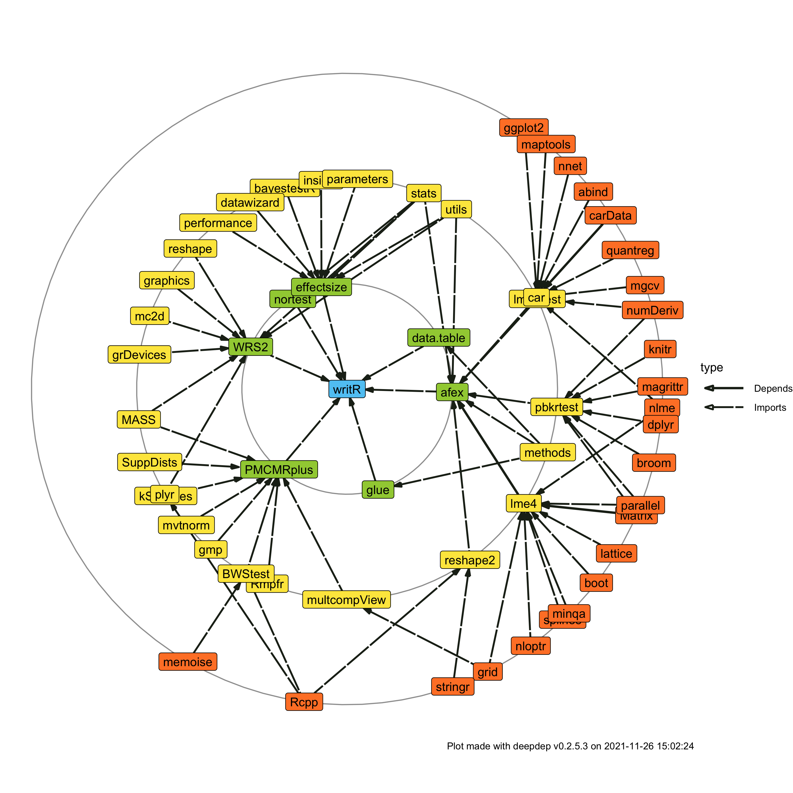

<!-- README.md is generated from README.Rmd. Please edit that file -->

#  writR

<!-- badges: start -->

[](https://doi.org/10.5281/zenodo.4603838)
[](https://lifecycle.r-lib.org/articles/stages.html#experimental)
[](https://CRAN.R-project.org/package=writR)
[](https://github.com/matcasti/writR/actions/workflows/R-CMD-check.yaml)
<!-- badges: end -->

An R package for automated inferential testing (for group differences)
and reporting based on parametric assumptions, which are tested
automatically for test selection.

## Installation

You can install the development version of writR from
[GitHub](https://github.com/) with:

``` r
# install.packages("devtools")
devtools::install_github("matcasti/writR")
```

## Summary of available tests using `autest()` function

#### For paired samples designs

| Nº of groups | Type                           | Test                                        | Function in `R`        |
|:------------:|--------------------------------|---------------------------------------------|------------------------|
|      2       | `type = 'p'`: parametric.      | Student’s t-test.                           | `stats::t.test`        |
|      2       | `type = 'r'`: robust.          | Yuen’s test for trimmed means.              | `WRS2::yuend`          |
|      2       | `type = 'np'`: non-parametric. | Wilcoxon signed-rank test.                  | `stats::wilcox.test`   |
|     \> 2     | `type = 'p'`: parametric.      | One-way repeated measures ANOVA (rmANOVA).  | `afex::aov_ez`         |
|     \> 2     | `type = 'p'`: parametric.      | rmANOVA with Greenhouse-Geisser correction. | `afex::aov_ez`         |
|     \> 2     | `type = 'p'`: parametric.      | rmANOVA with Huynh-Feldt correction.        | `afex::aov_ez`         |
|     \> 2     | `type = 'r'`: robust.          | Heteroscedastic rmANOVA for trimmed means.  | `WRS2::rmanova`        |
|     \> 2     | `type = 'np'`: non-parametric. | Friedman rank sum test.                     | `stats::friedman.test` |

#### For independent samples design

| Nº of groups | Type                           | Test                                             | Function in `R`       |
|:------------:|--------------------------------|--------------------------------------------------|-----------------------|
|      2       | `type = 'p'`: parametric.      | Student’s t-test.                                | `stats::t.test`       |
|      2       | `type = 'p'`: parametric.      | Welch’s t-test.                                  | `stats::t.test`       |
|      2       | `type = 'r'`: robust.          | Yuen’s test for trimmed means.                   | `WRS2::yuen`          |
|      2       | `type = 'np'`: non-parametric. | Mann-Whitney *U* test.                           | `stats::wilcox.test`  |
|     \> 2     | `type = 'p'`: parametric.      | Fisher’s One-way ANOVA.                          | `stats::oneway.test`  |
|     \> 2     | `type = 'p'`: parametric.      | Welch’s One-way ANOVA.                           | `stats::oneway.test`  |
|     \> 2     | `type = 'np'`: non-parametric. | Kruskal-Wallis one-way ANOVA.                    | `stats::kruskal.test` |
|     \> 2     | `type = 'r'`: robust.          | Heteroscedastic one-way ANOVA for trimmed means. | `WRS2::t1way`         |

#### Corresponding Post-Hoc tests for Nº groups \> 2

|   Design    | Type                                            | Test                                                                                                                                                          | Function in `R`                 |
|:-----------:|-------------------------------------------------|---------------------------------------------------------------------------------------------------------------------------------------------------------------|---------------------------------|
|   Paired    | `type = 'p'`: parametric.                       | Student’s t-test.                                                                                                                                             | `stats::pairwise.t.test`        |
|   Paired    | `type = 'np'`: non-parametric.                  | Conover-Iman all-pairs comparison test.                                                                                                                       | `PMCMRplus::durbinAllPairsTest` |
|   Paired    | `type = 'r'`: robust.                           | Yuen’s test for trimmed means (see [Wilcox, 2012](http://mqala.co.za/veed/Introduction%20to%20Robust%20Estimation%20and%20Hypothesis%20Testing.pdf), p. 385). | `WRS2::rmmcp`                   |
| Independent | `type = 'p'`: parametric + `var.equal = TRUE`.  | Student’s t-test.                                                                                                                                             | `stats::pairwise.t.test`        |
| Independent | `type = 'p'`: parametric + `var.equal = FALSE`. | Games-Howell test.                                                                                                                                            | `PMCMRplus::gamesHowellTest`    |
| Independent | `type = 'np'`: non-parametric.                  | Dunn’s test.                                                                                                                                                  | `PMCMRplus::kwAllPairsDunnTest` |
| Independent | `type = 'r'`: robust.                           | Yuen’s test for trimmed means (see [Mair and Wilcox](https://rdrr.io/rforge/WRS2/f/inst/doc/WRS2.pdf)).                                                       | `WRS2::lincon`                  |

#### Available effect sizes

| Nº of groups | Test           | Effect size                                             |
|:------------:|----------------|---------------------------------------------------------|
|      2       | Parametric     | Cohens’d                                                |
|      2       | Parametric     | Hedges’g                                                |
|      2       | Non-parametric | Rank-biserial correlation                               |
|      2       | Robust         | Algina-Keselman-Penfield robust standardized difference |
|     \> 2     | Parametric     | Eta-squared                                             |
|     \> 2     | Parametric     | Omega-squared                                           |
|     \> 2     | Non-parametric | Epsilon-squared                                         |
|     \> 2     | Robust         | Explanatory measure of effect size                      |

# Automated testing

By default, `k_sample()`, checks automatically the assumptions of the
data based on the parameters supplied for test selection.

``` r
library(writR) # Load the writR package 

set.seed(123) # for reproducibility
diets <- data.frame(
    weight = c(rnorm(n = 100/2, mean = 70, sd = 7)   # Treatment
             , rnorm(n = 100/2, mean = 66, sd = 7) ) # Control
  , diet = gl(n = 2, k = 100/2, labels = c('Treatment', 'Control') ) )
  
result <- k_sample( 
  data = diets, 
  x = "diet", # independent variable
  y = "weight", # dependent variable
  type = NULL, # default, checks assumptions then choose appropiate test
)

print(result) # Detailed statistical results
#>         y      x statistic    df df.error    p.value         method   estimate
#>    <char> <char>     <num> <num>    <num>      <num>         <char>      <num>
#> 1: weight   diet  6.292829     1       98 0.01376398 Fisher's ANOVA 0.05026771
#>    conf.level    conf.low conf.high              effectsize n_obs
#>         <num>       <num>     <num>                  <char> <int>
#> 1:       0.95 0.003432758         1 Omega-squared (partial)   100
```

## Inline results in APA style

The core function: `k_sample()` by default return a list of length 13
with detailed statistics, if inline results are desired, the `lablr()`
function can be used.

An example using same data as before:

> The analysis of the effects of the treatment, shows that experimental
> group had greater weight than control, `inline$full`.

translates into this:

> The analysis of the effects of the treatment, shows that experimental
> group had greater weight than control, F(1, 98) = 6.29, p 0.014,
> omega2 = 0.05, CI95 \[0.00, 1.00\].

It also let you perform centrality and dispersion statistics for inline
results by using the `cent_disp()` function. The next example
illustrates its usage:

``` r
data <- datasets::ToothGrowth

result <- with(data, tapply(
  len,              ## Variable to describe
  list(supp, dose), ## Variables to aggregate on
  cent_disp         ## cent_disp() function
  ))

as.data.frame(result)
#>                       0.5                      1                      2
#> OJ *M* = 13.2, *SD* = 4.5 *M* = 22.7, *SD* = 3.9 *M* = 26.1, *SD* = 2.7
#> VC    *M* = 8, *SD* = 2.7 *M* = 16.8, *SD* = 2.5 *M* = 26.1, *SD* = 4.8
```

> The effect of vitamin C on tooth growth was explored in Guinea Pigs,
> were the group using orange juice (OJ) demonstrated similar values
> (`result['OJ','2']`) than vitamin C (VC) group (`result['VC','2']`) in
> tooth length (TL) at 2 miligrams/day. However, at doses of 0.5
> miligrams/day, the OJ group did show greater TL (`result['OJ','0.5']`)
> than VC group (`result['VC','0.5']`).

translates into this:

> The effect of vitamin C on tooth growth was explored in Guinea Pigs,
> were the group using orange juice (OJ) demonstrated similar values
> (*M* = 26.1, *SD* = 2.7) than vitamin C (VC) group (*M* = 26.1, *SD* =
> 4.8) in tooth length (TL) at 2 miligrams/day. However, at doses of 0.5
> miligrams/day, the OJ group did show greater TL (*M* = 13.2, *SD* =
> 4.5) than VC group (*M* = 8, *SD* = 2.7).

You can also set your own custom expressions using glue syntax like
this:

``` r
cent_disp(
  x = data$len, 
  str.a = "The median for length was {median} mm (MAD = {mad}, IQR = {IQR})",
  k = 1 # For 1 decimal places
)
#> The median for length was 19.2 mm (MAD = 9, IQR = 12.2)
```

It allows you to use any function available in your global environment
or in attached packages, even custom functions:

``` r
q25 <- function(i) quantile(i, 0.25)[[1L]]
q75 <- function(j) quantile(j, 0.75)[[1L]]

cent_disp(
  x = data$len,
  str.a = "The median for length was {median} mm (IQR = [{q25}, {q75}])",
  k = 1
)
#> The median for length was 19.2 mm (IQR = [13.1, 25.3])
```

## Paired samples design

For paired designs you need to set `paired = TRUE`, and then, based on
the numbers of groups detected after removing missing values, the test
will run depending on the parameters stablished.

#### \> 2 groups

When `type = 'auto'` the next assumptions will be checked for \> 2
paired samples:

| Assumption checked | How is tested             | If met                                    | If not                                                            |
|--------------------|---------------------------|-------------------------------------------|-------------------------------------------------------------------|
| Normality          | `stats::shapiro.test`     | Sphericity check.                         | Friedman rank sum test                                            |
| Sphericity         | `sphericity_check(model)` | One-way repeated measures ANOVA (rmANOVA) | Greenhouse-Geisser (GG) or Huynh-Feldt (HF) correction is applied |

``` r
n <- 40
set.seed(123)
cancer <- data.frame(
  id = rep(seq_len(n), 3)
  , cells = round(c(rnorm(n = n, mean = 100, sd = 15)   # Basal
           , rnorm(n = n, mean = 98, sd = 10)   # Time-1
           , rnorm(n = n, mean = 96, sd = 5) )) # Time-2
  , period = gl(n = 3, k = n, labels = c('Basal', 'Time-1', 'Time-2') ) )

result <- k_sample(
  data = cancer
  , x = "period"
  , y = "cells"
  , rowid = "id"
  , paired = TRUE
  )

# Access the whole results
print(result)
#>         y      x statistic      df df.error   p.value                method
#>    <char> <char>     <num>   <num>    <num>     <num>                <char>
#> 1:  cells period  2.231395 1.77965 69.40635 0.1206689 Huynh-Feldt's rmANOVA
#>      estimate conf.level conf.low conf.high              effectsize n_obs
#>         <num>      <num>    <num>     <num>                  <char> <num>
#> 1: 0.01998957       0.95        0         1 Omega-squared (partial)    40

# For inline resutls or statistical reports
lablr(result)
#>                  stats       p            es                ci
#>                 <char>  <char>        <char>            <char>
#> 1: F(1.8, 69.4) = 2.23 p 0.121 omega2 = 0.02 CI95 [0.00, 1.00]
#>                                                              full
#>                                                            <char>
#> 1: F(1.8, 69.4) = 2.23, p 0.121, omega2 = 0.02, CI95 [0.00, 1.00]
```

However, you can specify your own parameters for the selection of the
test:

| Test                                       | Parameters                                             |
|--------------------------------------------|--------------------------------------------------------|
| One-way repeated measures ANOVA (rmANOVA)  | `paired = TRUE` + `type = 'p'` + `sphericity = 'none'` |
| rmANOVA with Greenhouse-Geisser correction | `paired = TRUE` + `type = 'p'` + `sphericity = 'GG'`   |
| rmANOVA with Huynh-Feldt correction        | `paired = TRUE` + `type = 'p'` + `sphericity = 'HF'`   |
| Heteroscedastic rmANOVA for trimmed means  | `paired = TRUE` + `type = 'r'`                         |
| Friedman rank sum test                     | `paired = TRUE` + `type = 'np'`                        |

#### 2 groups

Similar as before, if `type = 'auto'` assumptions will be checked for 2
paired samples:

| Assumption checked | How is tested         | If met           | If not                    |
|--------------------|-----------------------|------------------|---------------------------|
| Normality          | `stats::shapiro.test` | Student’s t-test | Wilcoxon signed-rank test |

``` r
cancer_two <- cancer[cancer$period %in% c('Time-1','Time-2'),]
  
result <- k_sample(
  data = cancer_two
  , x = "period"
  , y = "cells"
  , paired = TRUE
)

# Access the whole results
print(result)
#>         y      x statistic    df df.error   p.value           method   estimate
#>    <char> <char>     <num> <num>    <num>     <num>           <char>      <num>
#> 1:  cells period  1.196787     1       39 0.2806758 Fisher's rmANOVA 0.00267743
#>    conf.level conf.low conf.high              effectsize n_obs
#>         <num>    <num>     <num>                  <char> <num>
#> 1:       0.95        0         1 Omega-squared (partial)    40

# For inline results
lablr(result)
#>              stats       p            es                ci
#>             <char>  <char>        <char>            <char>
#> 1: F(1, 39) = 1.20 p 0.281 omega2 = 0.00 CI95 [0.00, 1.00]
#>                                                          full
#>                                                        <char>
#> 1: F(1, 39) = 1.20, p 0.281, omega2 = 0.00, CI95 [0.00, 1.00]
```

Same as above, you can specify your own parameters for the selection of
the test:

| Test                                               | Parameters                      |
|----------------------------------------------------|---------------------------------|
| Student’s t-test for paired samples                | `paired = TRUE` + `type = 'p'`  |
| Wilcoxon signed-rank test                          | `paired = TRUE` + `type = 'np'` |
| Yuen’s test on trimmed means for dependent samples | `paired = TRUE` + `type = 'r'`  |

## Independent samples design

For independent samples you need to set `paired = FALSE`, and then,
based on the numbers of groups detected, the test will run depending on
the parameters stablished.

#### \> 2 groups

When `type = 'auto'` the next assumptions will be checked for \> 2
independent samples:

| Assumption checked       | How is tested                                  | If met                          | If not               |
|--------------------------|------------------------------------------------|---------------------------------|----------------------|
| Normality                | `stats::shapiro.test`                          | Homogeneity of variances check. | Kruskal-Wallis ANOVA |
| Homogeneity of variances | Levene’s test on medians with `is_var.equal()` | Fisher’s ANOVA                  | Welch’s ANOVA        |

``` r
set.seed(123)
cancer_unpaired <- data.frame(
    cells = round(c(rnorm(n = n, mean = 100, sd = 20)   # Control
           , rnorm(n = n, mean = 95, sd = 12)   # Drug A
           , rnorm(n = n, mean = 90, sd = 15) )) # Drug B
  , group = gl(n = 3, k = n, labels = c('Control', 'Drug A', 'Drug B') ) )

result <- k_sample(
  data = cancer_unpaired
  , x = "group"
  , y = "cells"
  , paired = FALSE
  , posthoc = TRUE
  )

# Check results
print(result)
#>         y      x statistic    df df.error    p.value        method   estimate
#>    <char> <char>     <num> <num>    <num>      <num>        <char>      <num>
#> 1:  cells  group  4.861757     2 75.91708 0.01030964 Welch's ANOVA 0.08914428
#>    conf.level    conf.low conf.high              effectsize n_obs
#>         <num>       <num>     <num>                  <char> <int>
#> 1:       0.95 0.005281224         1 Omega-squared (partial)   120

# For inline results
lablr(result)
#>                  stats       p            es                ci
#>                 <char>  <char>        <char>            <char>
#> 1: F(2.0, 75.9) = 4.86 p 0.010 omega2 = 0.09 CI95 [0.01, 1.00]
#>                                                              full
#>                                                            <char>
#> 1: F(2.0, 75.9) = 4.86, p 0.010, omega2 = 0.09, CI95 [0.01, 1.00]
```

However, you can specify your own parameters for the selection of the
test:

| Test                                            | Parameters                                            |
|-------------------------------------------------|-------------------------------------------------------|
| Fisher’s One-way ANOVA                          | `paired = FALSE` + `type = 'p'` + `var.equal = TRUE`  |
| Welch’s One-way ANOVA                           | `paired = FALSE` + `type = 'p'` + `var.equal = FALSE` |
| Kruskal–Wallis one-way ANOVA                    | `paired = FALSE` + `type = 'np'`                      |
| Heteroscedastic one-way ANOVA for trimmed means | `paired = FALSE` + `type = 'r'`                       |

#### 2 groups

Just like above, if `type = 'auto'` assumptions will be checked for 2
independent samples:

| Assumption checked       | How is tested                                  | If met                          | If not                |
|--------------------------|------------------------------------------------|---------------------------------|-----------------------|
| Normality                | `stats::shapiro.test`                          | Homogeneity of variances check. | Mann-Whitney *U* test |
| Homogeneity of variances | Levene’s test on medians with `is_var.equal()` | Student’s t-test                | Welch’s t-test        |

``` r
result <- k_sample(
  data = cancer_unpaired[cancer_unpaired$group %in% c('Drug A','Drug B'),]
  , x = "group"
  , y = "cells"
  , var.equal = FALSE
  )

# For tabular results
print(result)
#>         y      x statistic    df df.error    p.value         method   estimate
#>    <char> <char>     <num> <num>    <num>      <num>         <char>      <num>
#> 1:  cells  group   3.08189     1       78 0.08309445 Fisher's ANOVA 0.02536358
#>    conf.level conf.low conf.high              effectsize n_obs
#>         <num>    <num>     <num>                  <char> <int>
#> 1:       0.95        0         1 Omega-squared (partial)    80

# For inline results (e.g. manuscript)
lablr(result)
#>              stats       p            es                ci
#>             <char>  <char>        <char>            <char>
#> 1: F(1, 78) = 3.08 p 0.083 omega2 = 0.03 CI95 [0.00, 1.00]
#>                                                          full
#>                                                        <char>
#> 1: F(1, 78) = 3.08, p 0.083, omega2 = 0.03, CI95 [0.00, 1.00]
```

You can specify your own parameters for the selection of the test as
well:

| Test                                     | Parameters                                            |
|------------------------------------------|-------------------------------------------------------|
| Student’s t-test for independent samples | `paired = FALSE` + `type = 'p'` + `var.equal = TRUE`  |
| Welch’s t-test for independent samples   | `paired = FALSE` + `type = 'p'` + `var.equal = FALSE` |
| Mann–Whitney *U* test                    | `paired = FALSE` + `type = 'np'`                      |
| Yuen’s test on trimmed means             | `paired = FALSE` + `type = 'r'`                       |

## Mixed effects ANOVA

By using `aov_r` function is possible to get the statistical report of
between/within-subject(s) factor(s) for factorial designs using `afex`
package under the hood for statistical reporting. Let’s see an example

``` r
# set parameters to simulate data with a between and within subject factor
within <- 3
between <- 2
n <- 70

set.seed(123)
stroop <- data.frame(
  subject = rep(1:n, within),
  gender = gl(between, n/between, length = n*within, labels = c('Male','Female')),
  time = gl(within, n, length = n*within),
  score = rnorm(n*within, mean = 150, sd = 30))

# Manipulate data to generate interaction between Gender and Time
stroop <- within(stroop, {
  score[gender == 'Male' & time == 1] <- score[gender == 'Male' & time == 1]*1
  score[gender == 'Male' & time == 2] <- score[gender == 'Male' & time == 2]*1.15
  score[gender == 'Male' & time == 3] <- score[gender == 'Male' & time == 3]*1.3
  score[gender == 'Female' & time == 1] <- score[gender == 'Female' & time == 1]*1
  score[gender == 'Female' & time == 2] <- score[gender == 'Female' & time == 2]*0.85
  score[gender == 'Female' & time == 3] <- score[gender == 'Female' & time == 3]*0.7
})


result <- aov_r(
  data = stroop
, response = "score"
, between = "gender"
, within = "time"
, rowid = "subject"
, effsize.type = 'omega' # omega squared as our measure of effect size
, sphericity = 'auto' # check if sphericity is not being violated
)

# Check results
print(result)
#>         y           x   statistic    df df.error      p.value           method
#>    <char>      <char>       <num> <num>    <num>        <num>           <char>
#> 1:  score      gender 130.7357382     1       68 1.720992e-17   Fisher's ANOVA
#> 2:  score        time   0.2367333     2      136 7.895263e-01 Fisher's rmANOVA
#> 3:  score gender:time  42.8799011     2      136 3.635914e-15 Fisher's rmANOVA
#>     estimate conf.level  conf.low conf.high     effectsize n_obs
#>        <num>      <num>     <num>     <num>         <char> <int>
#> 1: 0.6495369       0.95 0.5389314         1 Omega2_partial    70
#> 2: 0.0000000       0.95 0.0000000         1 Omega2_partial    70
#> 3: 0.2893804       0.95 0.1844234         1 Omega2_partial    70

# And inline results for reporting purposes
inline <- result[j = lablr(.SD), keyby = x]

print(inline[,c("x", "full")])
#> Key: <x>
#>              x                                                         full
#>         <char>                                                       <char>
#> 1:      gender F(1, 68) = 130.74, p 2e-17, omega2 = 0.65, CI95 [0.54, 1.00]
#> 2: gender:time F(2, 136) = 42.88, p 4e-15, omega2 = 0.29, CI95 [0.18, 1.00]
#> 3:        time  F(2, 136) = 0.24, p 0.790, omega2 = 0.00, CI95 [0.00, 1.00]
```

For inline results with previous data we would do something like this:

> In order to analyze the effect of gender on subjects’ scores in each
> of the evaluation periods, we performed an analysis of variance
> (ANOVA) with between- and within-subjects factors. From the analyses,
> we find that gender has a large effect (
> `inline["gender", paste(es, ci, sep = ", ")]` ) on scores when
> adjusting for each of the time periods,
> `inline["gender", paste(stats, p, sep = ", ")]`. In a similar way we
> find a significant interaction between evaluative time and gender (
> `inline["gender:time", paste(stats, p, sep = ", ")]` ), indicating
> unequal responses between males and females over time,
> `inline["gender:time", paste(es, ci, sep = ", ")]`, however, time
> alone is not able to explain statistically significantly the variance
> in scores, `inline["time"]$full`.

Which will translate into this after evaluation in R Markdown:

> In order to analyze the effect of gender on subjects’ scores in each
> of the evaluation periods, we performed an analysis of variance
> (ANOVA) with between- and within-subjects factors. From the analyses,
> we find that gender has a large effect (omega2 = 0.65, CI95 \[0.54,
> 1.00\]) on scores when adjusting for each of the time periods, F(1,
> 68) = 130.74, p \< 0.001. In a similar way we find a significant
> interaction between evaluative time and gender ( F(2, 136) = 42.88, p
> \< 0.001 ), indicating unequal responses between males and females
> over time, omega2 = 0.29, CI95 \[0.17, 0.40\], however, time alone is
> not able to explain statistically significantly the variance in
> scores, F(2, 136) = 0.24, p = 0.79, omega2 = -0.01, CI95 \[0.00,
> 0.00\].

When you have more than 1 factor (between or within subjects) you have
to specify them as a character vector:
`between = c('factor1', 'factor2' ...)`, and the same for
`within = c('factor1', 'factor2' ...)`.

## Testing categorical data

To test purely categorical data, `contingency()` function is your guy.

### Goodness-of-fit Chi-squared

By only filling the `data`, and `x` argument, the Goodness-of-fit
chi-squared test (χ<sup>2</sup><sub>gof</sub>)

``` r
result <- contingency(
  data = cancer_unpaired[-(1:10),], # 3 groups: Control, Drug A, Drug B
  x = "group"
)

# Tabular format dropping empty columns
print(result)
#>         x statistic    df   p.value                                   method
#>    <char>     <num> <num>     <num>                                   <char>
#> 1:  group  1.818182     2 0.4028903 Chi-squared test for given probabilities
#>     estimate conf.level conf.low conf.high  effectsize
#>        <num>      <num>    <num>     <num>      <char>
#> 1: 0.1275153       0.95        0         1 Pearson's C

# For inline results
inline <- lablr(result, markdown = T)
```

And the inline result would look like this:

> In preliminary analyses, we’ve seen that the proportion of pacients
> the same across groups, `inline$full`.

translates into:

> In preliminary analyses, we’ve seen that the proportion of pacients
> the same across groups, X2(2) = 0.00, p = 1, V = 0.00, CI95 \[0.00,
> 0.00\].

### Pearson’s Chi-squared

By providing `x` and `y` arguments on `contingency()` you get Pearson’s
Chi-squared test.

``` r
result <- contingency(
  data = mtcars, # Using mtcars data
  x = "cyl",
  y = "gear"
)

# Statistics in tabular format
print(result)
#>         y      x statistic    df     p.value                     method
#>    <char> <char>     <num> <int>       <num>                     <char>
#> 1:   gear    cyl  18.03636     4 0.001214066 Pearson's Chi-squared test
#>     estimate conf.level   conf.low conf.high effectsize
#>        <num>      <num>      <num>     <num>     <char>
#> 1: 0.4819631       0.95 0.07050663         1 Cramer's V

# Inline results format
lablr(result)
#>            stats       p       es                ci
#>           <char>  <char>   <char>            <char>
#> 1: X2(4) = 18.04 p 0.001 V = 0.48 CI95 [0.07, 1.00]
#>                                                   full
#>                                                 <char>
#> 1: X2(4) = 18.04, p 0.001, V = 0.48, CI95 [0.07, 1.00]
```

### Fisher’s exact test

Otherwise, you could use Fisher’s exact test for count data if you
specify `exact = TRUE`.

``` r
result <- contingency(
  data = mtcars, 
  x = "cyl",
  y = "gear",
  exact = TRUE 
)

# Statistics in tabular format
print(result)
#>         y      x statistic    df     p.value                     method
#>    <char> <char>     <num> <int>       <num>                     <char>
#> 1:   gear    cyl  18.03636     4 0.001214066 Pearson's Chi-squared test
#>     estimate conf.level   conf.low conf.high effectsize
#>        <num>      <num>      <num>     <num>     <char>
#> 1: 0.4819631       0.95 0.07050663         1 Cramer's V

# Inline results format
lablr(result)
#>            stats       p       es                ci
#>           <char>  <char>   <char>            <char>
#> 1: X2(4) = 18.04 p 0.001 V = 0.48 CI95 [0.07, 1.00]
#>                                                   full
#>                                                 <char>
#> 1: X2(4) = 18.04, p 0.001, V = 0.48, CI95 [0.07, 1.00]
```

### McNemar’s Chi-squared Test

If you have a paired design and are using only categorical variables,
then McNemar’s Chi-squared Test for Count data is your test to go.

``` r
## Presidential Approval Ratings.
## Approval of the President's performance in office in two surveys,
## one month apart, for a random sample of 1600 voting-age Americans.

performance <- data.frame(
  id = rep(1:1600, 2),
  `1st survey` = c(rep("Approve", 944), rep("Disapprove", 656)),
  `2nd survey` = c(rep("Approve", 794), rep("Disapprove", 150),
                   rep("Approve", 86), rep("Disapprove", 570)), check.names = F)

result <- contingency(
  data = performance,
  x = "1st survey",
  y = "2nd survey",
  paired = TRUE # Set TRUE for McNemar test
)

# Statistics in tabular format
print(result)
#>             y          x statistic    df      p.value
#>        <char>     <char>     <num> <num>        <num>
#> 1: 2nd survey 1st survey  34.71186     1 3.822946e-09
#>                        method  estimate conf.level   conf.low conf.high
#>                        <char>     <num>      <num>      <num>     <num>
#> 1: McNemar's Chi-squared test 0.1355932       0.95 0.09124332 0.1777538
#>    effectsize
#>        <char>
#> 1:  Cohen's g

# Inline results
lablr(result)
#>            stats       p       es                ci
#>           <char>  <char>   <char>            <char>
#> 1: X2(1) = 34.71 p 4e-09 g = 0.14 CI95 [0.09, 0.18]
#>                                                   full
#>                                                 <char>
#> 1: X2(1) = 34.71, p 4e-09, g = 0.14, CI95 [0.09, 0.18]
```

## Dependencies

The package writR is standing on the shoulders of giants. `writR`
depends on the following packages:

``` r
deepdep::plot_dependencies('writR', local = TRUE, depth = 3)
```



## Acknowledgments

I would like to thank to developers of `statsExpressions` and
`ggstatsplot` for being an inspiration for this package. Naturally this
package is in its first steps, but I hope that future collaborative work
can expand the potential of this package.

## Citation

To cite package ‘writR’ in publications run the following code in your
`R` console:

``` r
citation('writR')
#> To cite package 'writR' in publications use:
#> 
#>   Castillo Aguilar M (2021). _writR: Inferential statistics and
#>   reporting in APA style_. R package version 1.0.1,
#>   <https://github.com/matcasti/writR>.
#> 
#> A BibTeX entry for LaTeX users is
#> 
#>   @Manual{,
#>     title = {writR: Inferential statistics and reporting in APA style},
#>     author = {Matías {Castillo Aguilar}},
#>     year = {2021},
#>     note = {R package version 1.0.1},
#>     url = {https://github.com/matcasti/writR},
#>   }
```
