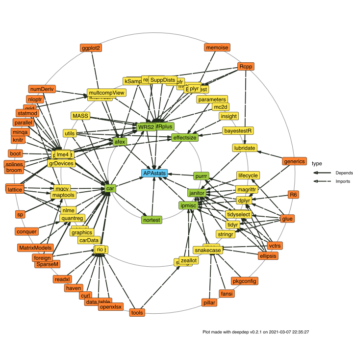

# APAstats

For automated and basic inferential testing, lets you perform:

-   Student's or Welch's *t*-test
-   Mann–Whitney *U* test
-   Yuen's test for trimmed means
-   Fisher's or Welch's one-way ANOVA
-   Kruskal–Wallis one-way ANOVA
-   Heteroscedastic one-way ANOVA for trimmed means
-   Wilcoxon signed-rank test
-   Yuen's test on trimmed means for dependent samples
-   One-way repeated measures ANOVA
-   Friedman rank sum test
-   Heteroscedastic one-way repeated measures ANOVA for trimmed means

## Installation

For installation of developmental version run in your R console:

``` r
install.packages("devtools")
devtools::install_github('matcasti/APAstats')
```

and then restart your R session.

## Automated testing

By default, `report` function, checks automatically the assumptions of the test based on the parameters of the data entered

``` r
library(APAstats) # Load the APAstats package

plant <- datasets::PlantGrowth # Let's use the PlantGrowth package
                               # (installed by default in R)

result <- report(
  data = plant,
  variable = 'weight', # dependent variable
  by = 'group', # independent variable
  pairwise.comp = TRUE, # for pairwise comparisons in case of n groups > 2
  markdown = TRUE # output in Markdown format (for inline text)? otherwise plain text.
)

result
```

    ## $`post-hoc`
    ## 
    ##  Pairwise comparisons using t tests with pooled SD 
    ## 
    ## data:  data[[variable]] and data[[by]] 
    ## 
    ##      ctrl   trt1  
    ## trt1 0.1944 -     
    ## trt2 0.0877 0.0045
    ## 
    ## P value adjustment method: none 
    ## 
    ## $report
    ## [1] "*F* ~Fisher~ (2, 27) = 4.846, *p* = 0.016, $\\eta$^2^ = 0.26, IC~95%~[0.01, 0.49]"
    ## 
    ## $method
    ## [1] "Fisher's ANOVA for independent samples"

## Inline results in APA style

The core function `report` by default return a list of length two in Markdown format (as seen before), for inline results. An example using same data as before:

The analysis of the effects of the treatment shows an statistically significant difference between the groups, `result$report`, evaluated through `result$method`.

translates into this:

The analysis of the effects of the treatment shows an statistically significant difference between the groups, *F* (2, 27) = 4.846, *p* = 0.016, η² = 0.26, IC 95% [0.01, 0.49], evaluated through Fisher's ANOVA for independent samples.

, evaluated through Fisher's ANOVA for independent samples., evaluated through Fisher's ANOVA for independent samples.

## Citation

To cite package 'APAstats' in publications run the following code in your `R` console:

``` r
citation('APAstats')
```

    ## 
    ## To cite package 'APAstats' in publications use:
    ## 
    ##   Matías Castillo Aguilar (2021). APAstats: Inferential statistics and
    ##   reporting in APA style. R package version 0.0.1.
    ## 
    ## A BibTeX entry for LaTeX users is
    ## 
    ##   @Manual{,
    ##     title = {APAstats: Inferential statistics and reporting in APA style},
    ##     author = {Matías {Castillo Aguilar}},
    ##     year = {2021},
    ##     note = {R package version 0.0.1},
    ##   }

## Dependencies

The package APAstats is standing on the shoulders of giants:

``` r
library(deepdep)
plot_dependencies('APAstats', local = TRUE, depth = 3)
```

<!-- -->

## Contact

For issues or collaborations on the package you can send me an email at:

-   matcasti\@umag.cl
